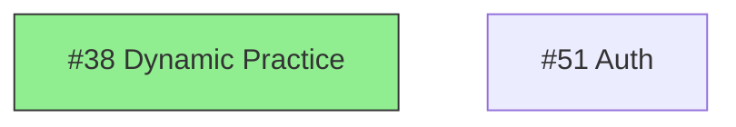

# Issue Dependency Mapping

## Overview

Analyze the issue catalog at `docs/issues/` to extract dependencies from "Related Issues" sections, build a dependency graph, and generate visualization documentation.

**Announce at start:** "I'm using the dependency-mapping skill to analyze issue relationships."

## Process

### Phase 1: Parse Issue Files
1. Read all issue markdown files from `docs/issues/*/`
2. Extract issue number, title, state, and milestone from metadata table
3. Parse "Related Issues" section for cross-references (format: `#XX`)
4. Build dependency map: `{issue_number: [depends_on_numbers]}`

### Phase 2: Analyze Dependencies
1. Identify dependency chains (A → B → C)
2. Find blocking issues (issues that many others depend on)
3. Detect orphan issues (no incoming or outgoing dependencies)
4. Check for circular dependencies
5. Calculate critical paths per milestone

### Phase 3: Generate Output
Write `docs/issues/dependencies.md` with:

```markdown
# Issue Dependencies

## Summary
- Total issues: X
- Issues with dependencies: X
- Orphan issues: X
- Critical blockers: X

## Dependency Graph

### Team MLP Dependencies
\`\`\`mermaid
graph TD
    subgraph Authentication
        51[#51 Auth]
    end
    subgraph Subscription
        52[#52 Team Sub]
        24[#24 Sub Mgmt]
    end
    51 --> 52
    52 --> 24
    ...
\`\`\`

### Gameplay Dependencies
\`\`\`mermaid
graph TD
    ...
\`\`\`

## Critical Paths

### Team MLP Critical Path
```
#51 (Auth) → #52 (Subscription) → #26 (Team Mgmt) → #27 (Dashboard)
```
**Length:** 4 issues
**Status:** All open

### Play System Critical Path
```
#22 (Play Manager) → #69 (Animation) → #40 (Field Plays)
```

## Blocking Issues
Issues that block 3+ other issues:

| # | Title | Blocks | State |
|---|-------|--------|-------|
| 51 | Authentication | 6 | Open |
| 22 | Play Manager | 3 | Open |

## Orphan Issues
Issues with no dependencies (can be worked on independently):

| # | Title | State | Milestone |
|---|-------|-------|-----------|
| ... | ... | ... | ... |

## Circular Dependencies
[None found / List if any]
```

## Dependency Extraction Rules

Parse "Related Issues" section for patterns:
- `#XX` - Direct reference
- `(prerequisite)` or `requires` - Indicates dependency
- `builds on` or `depends on` - Indicates dependency
- `parent feature` - Indicates this is a sub-issue

Create edges:
- If issue A "requires" or "depends on" issue B → A depends on B
- If issue A is "parent" of B → B depends on A
- If issue A "builds on" B → A depends on B

## Graph Styling

Use mermaid subgraphs to group by category:
- Team Features: blue
- Gameplay: green
- CI/CD: orange
- UI/UX: purple

Mark closed issues with strikethrough or different shape:


## Output Location

- Primary: `docs/issues/dependencies.md`

## Remember

- Only create edges for explicit dependency mentions
- Group issues by milestone/category in graphs
- Highlight open blockers prominently
- Include both text and visual representations
